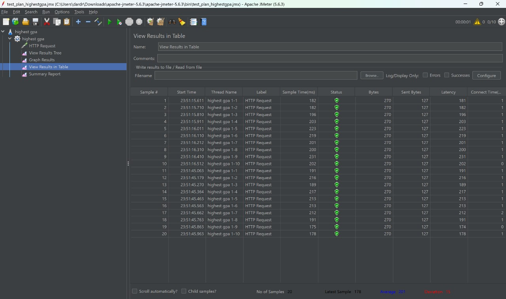
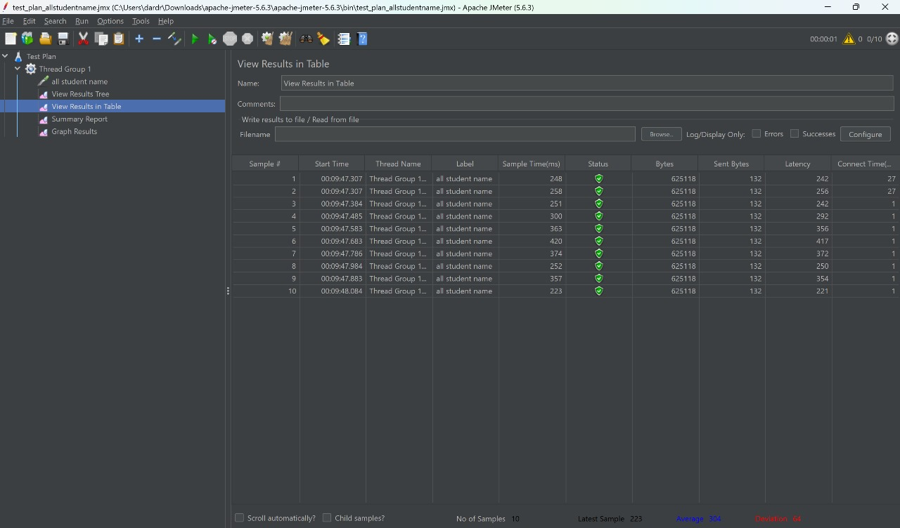
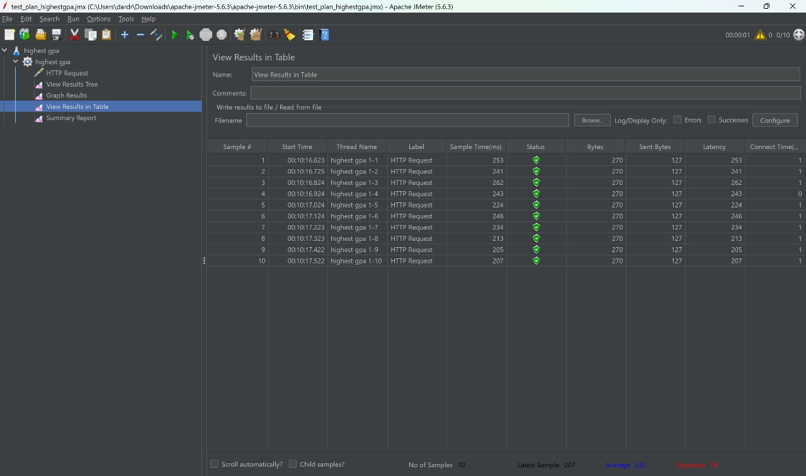

Before vs After
---
Before Refactor Profiling

After Refactor Profiling

Refleksi
---
1. JMeter mensimulasikan skenario lalu traffic internet sesungguhnya dengan menguji endpoint untuk mengukur performa aplikasi. Alat ini mengevaluasi skalabilitas, response time, dan perilaku sistem dengan pengguna scr bersamaan. Sementara itu, Profiler berfokus pada analisis tingkat kode yang granular, mengidentifikasi bottleneck (misalnya, penggunaan CPU, kebocoran memori, persaingan thread) untuk mengoptimasi area kode spesifik. JMeter menilai performa sistem secara keseluruhan, sedangkan Profiler menargetkan algoritma tidak efisien atau metode yang boros resource.
2. Profiling menemukan bottleneck performa dengan menganalisis metrik seperti siklus CPU, alokasi memori, aktivitas garbage collection, dan thread. Ini mengarahkan dev ke bagian kode kritis (misalnya, querying lambat atau excessive memory usage), memungkinkan optimisasi tepat sasaran tanpa mengubah seluruh basis kode. Contohnya, profiling bisa memberitahu bahwa metode seperti getAllStudentCourse() menyebabkan penundaan, sehingga refaktor dapat difokuskan untuk meningkatkan efisiensi.
3. IntelliJ Profiler sangat efektif berkat fitur seperti flame graph (visualisasi jalur eksekusi) dan pelacakan waktu eksekusi per metode. Contohnya, get request ke all-student sangat lambat pada awalnya, tetapi dengan Profiler, saya menjadi tahu bahwa penyebabnya adalah getAllStudentCourses()
4. Menurut saya, hasil profiling sulit diinterpretasikan lebih lanjut, jadi saya hanya memahami sebatas apa yang membuat lambat dan belum mampu mengeksploitasi sepenuhnya hasil analisis. Selain itu, refactor bottleneck juga bukan perkara yang mudah.
5. Sudah build-in dari IntelliJ, jadi tidak perlu set-up apa-apa lagi. Selain itu, hasil analisisnya menyajikan berbagai macam informasi, mulai dari metrik CPU, memory, dll.
6. Memastikan pengujian dilakukan pada kondisi identik karena faktor-faktor internal yang memberatkan penggunaan device bisa saja menyebabkan disparitas hasil. Melakukan pengecekan kembali apakah konfigurasi konsisten.
7. Pertama, cek hasil dengan Profiler dan JMeter karena dari sana, kita menjadi tahu "titik lemah" program kita. Lalu, lakukan optimisasi dengan refactor dan hal lainnya yang membuat desain kerja program jauh lebih efisien, dalam hal ini, SDA menurut saya menjadi mampu kerap diterapkan. Lalu, memastikan dari segala testing yang ada (unit-test dan functional-test), program masih berjalan sesuai intensi awal. Lalu, lihat hasilnya kembali dan jika belum sesuai yang diinginkan, coba optimisasi lagi.

